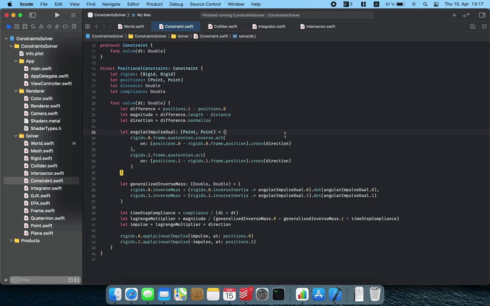

# Constraint Solver

Hobby project which aims to implementing position based dynamics for rigid bodies based on various papers.

Currently being rewritten in Rust on the separate branch `rust`, which will be merged into `main` when feature parity is reached.

[Publications of M. Müller](https://matthias-research.github.io/pages/publications/publications.html) — [Metal Documentation](https://developer.apple.com/documentation/metal) — [MetalKit Documentation](https://developer.apple.com/documentation/metalkit)

References:
1. [Detailed Rigid Body Simulation with Extended Position Based Dynamics, 2020](https://matthias-research.github.io/pages/publications/PBDBodies.pdf)
2. [Small Steps in Physics Simulation, 2019](http://mmacklin.com/smallsteps.pdf)
3. [Position-Based Simulation Methods in Computer Graphics, 2015](http://mmacklin.com/EG2015PBD.pdf)

---

